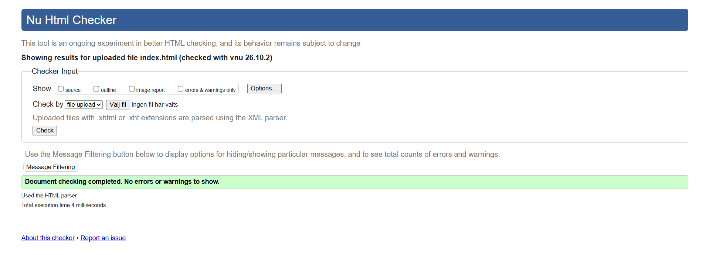
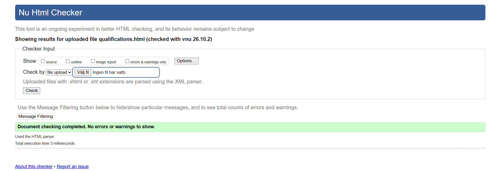
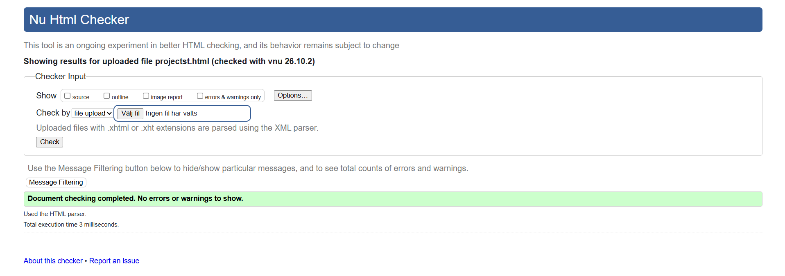
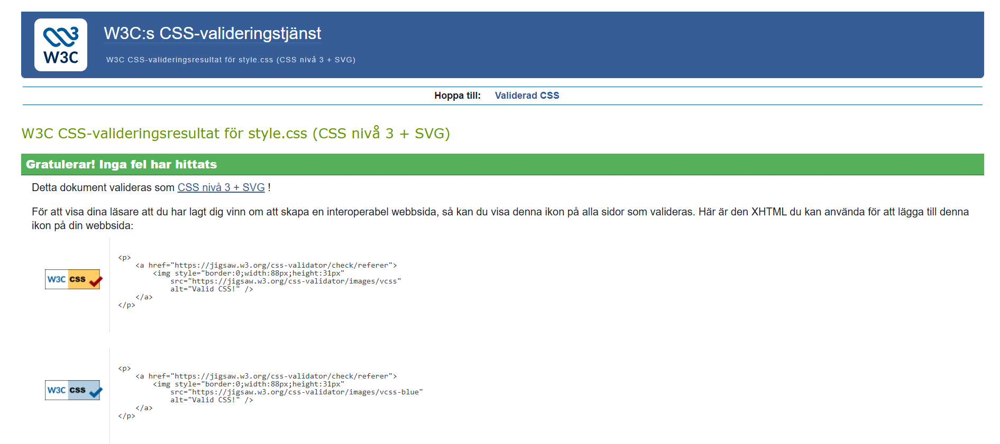

# Andrey's Dynamiska Portfolio

### Målet med projektet
Jag har fått i uppgift av min lärare att skapa ett portfolio som är dynamisk. En dynamisk webb-plats innebär att den anpassas för olika storlekar på skärmen. Projektet består enbart av html och css.

---
## Öppna hemsidan här --> [Index Page](./templates/index.html)

## W3C Validering
Projektets källkod har validerats via W3C. Här är skärmdumparna på valideringsresultaten:

*   **HTML - Startsida (index.html)**
    
*   **HTML - Sida 2**
    
*   **HTML - Sida 3**
    
*   **HTML - Sida 4**
    
*   **CSS - Styling (style.css)**
    
